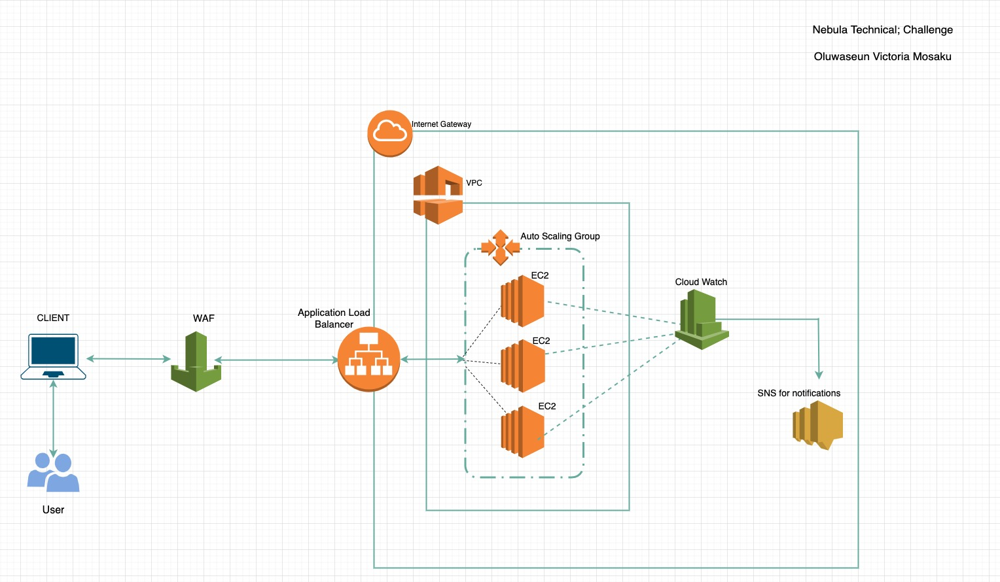

## AWS Solution
Cloud Formation files can be found in the cloud-formation directory

## How to Use Infrastructure As Code Yaml
Step 1: Virtual VPC must be created first: Ensure you use the cloud formation file named virtual-private-cloud.yaml to first create the Virtual private cloud

Step 2: The load-balancer-and-auto-scaling-group.yaml file should be used next taking into consideration the stack name of step 1 

## Architecture

